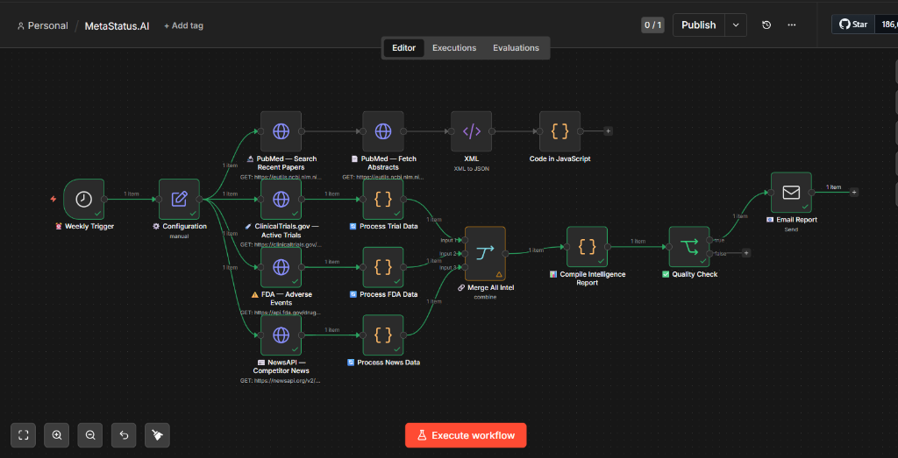
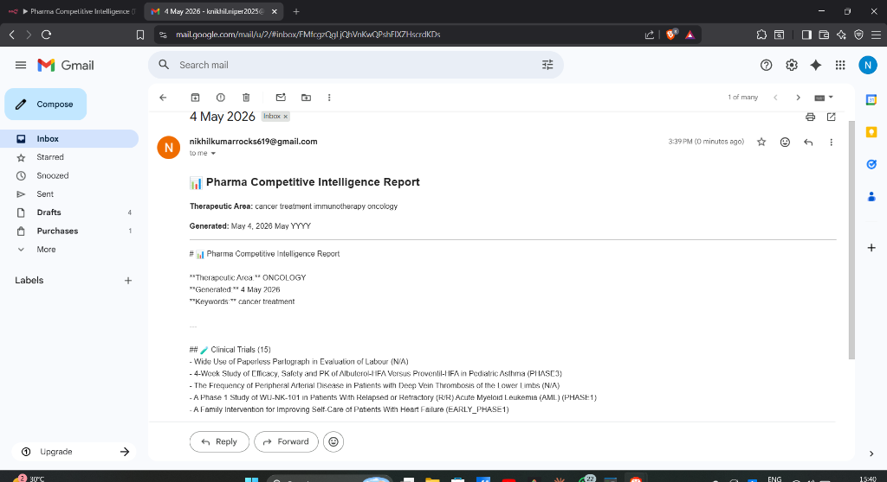

# MetaStatus.AI 📊

MetaStatus.AI is an automated competitive intelligence workflow built with [n8n](https://n8n.io/). It continuously monitors and aggregates critical pharmaceutical and healthcare data to provide actionable insights.

## Overview

The workflow runs on a weekly schedule, gathering up-to-date information across various facets of the pharmaceutical industry, specifically focusing on oncology and cancer treatments. It consolidates this data into a structured report and automatically emails it to the designated stakeholders.

## Screenshots

*n8n Workflow configuration showing multiple API integrations and data processing nodes.*

*Sample Pharma Competitive Intelligence Report automatically delivered via email.*

## Features & Data Sources

The workflow integrates with multiple APIs to fetch comprehensive data:
- **PubMed:** Searches for recent papers related to the configured drug keywords and fetches their abstracts.
- **ClinicalTrials.gov:** Monitors active and recruiting clinical trials related to specific therapeutic areas and filters them by top competitor companies (e.g., Pfizer, Roche, Novartis, AstraZeneca, Merck).
- **FDA Adverse Events API:** Retrieves recent adverse event reports for the current year.
- **NewsAPI:** Collects the latest news headlines regarding competitor companies and pharmaceutical drug approvals.

## Workflow Process

1. **Trigger:** A weekly schedule initiates the workflow.
2. **Configuration:** Sets up target keywords, competitor companies, therapeutic areas, and the recipient's email address.
3. **Data Fetching:** Parallel requests are made to PubMed, ClinicalTrials.gov, FDA, and NewsAPI.
4. **Data Processing:**
   - Filters clinical trials for those sponsored by specified competitors.
   - Summarizes top adverse events and reactions.
   - Extracts top news headlines.
   - Parses XML abstracts from PubMed to JSON.
5. **Compilation:** Merges all the processed data and generates a markdown-formatted intelligence report.
6. **Quality Check:** Ensures the generated report is not empty.
7. **Delivery:** Automatically sends the compiled report via email using SMTP.

## Setup & Installation

To use this workflow in your own n8n instance:
1. Open your n8n workspace.
2. Go to **Workflows** and click **Import from File**.
3. Select the `MetaStatus.AI.json` file.
4. Configure your credentials:
   - **NewsAPI:** Update the API key in the NewsAPI node (or use the configured one if it's a shared test key).
   - **Email:** Set up your SMTP credentials in the Email node to enable the report delivery.
5. Modify the `⚙️ Configuration` node with your preferred keywords, competitor companies, and email recipient.
6. Activate the workflow!
